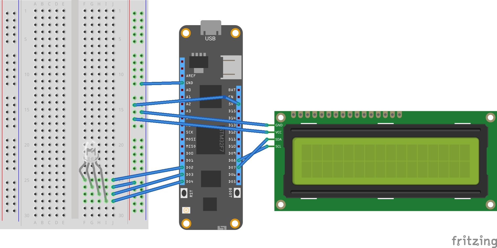

# MSFT Graph Presence IoT

This repository contains two applications, both are doing the same thing: get the presence information for the authenticated user (using the Microsoft Graph API, Device Code auth flow) and visualize it.
- PresenceConsoleApp is a .net core 3.1 app, utilizing the System.Device.Gpio package to control an RGB led. I run this app on a Raspberry Pi 3, with .net core 3.1 installed. This app uses the Microsoft.Graph client package to read the presence information.
- MeadowPresenceApp is for the Wilderness Labs Meadow F7 board, doing the same thing but also displays some more information on an LCD (such as logs or the user code). The Microsoft Graph client package would be an overkill for the microcontroller, so I use HttpClient to follow the device code auth flow and also to get the presence information. At the start, the application is looking for a config.json file with the required settings, such as Wifi SSID and password. Copy the example.config.json file, rename it to config.json, set the config values and don't forget to copy it into the output folder (f.e. through the Property window in VS).

## Meadow presence app
The Fritzing diagram is the following:

